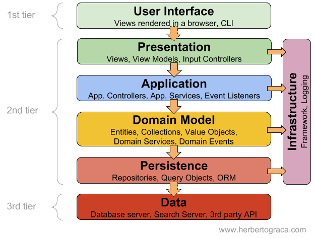

Domain Layer
====

- Contains classes that are part of the application domain.
- Must **not** be involved with **non-functional requirements** of the application. Example: security, log, transaction.
- **Independent** of persistence technology.

## Application Layers ##

This image was extracted from [Layered Architecture article.](https://herbertograca.com/2017/08/03/layered-architecture/")

### Hands on with [Conta Example Project.](https://github.com/persapiens/conta/tree/main/src/main/java/br/edu/ifrn/conta/dominio)

## :construction_worker: Task

Create one pull request for your project according to [Task Submission Guidelines.](../assessment.md#task-submission)

Create a diagram class of the domain classses of your application.

Implement the equals and natural comparator of your domain classes.

Create a **separate commit** to each step of this activity.

